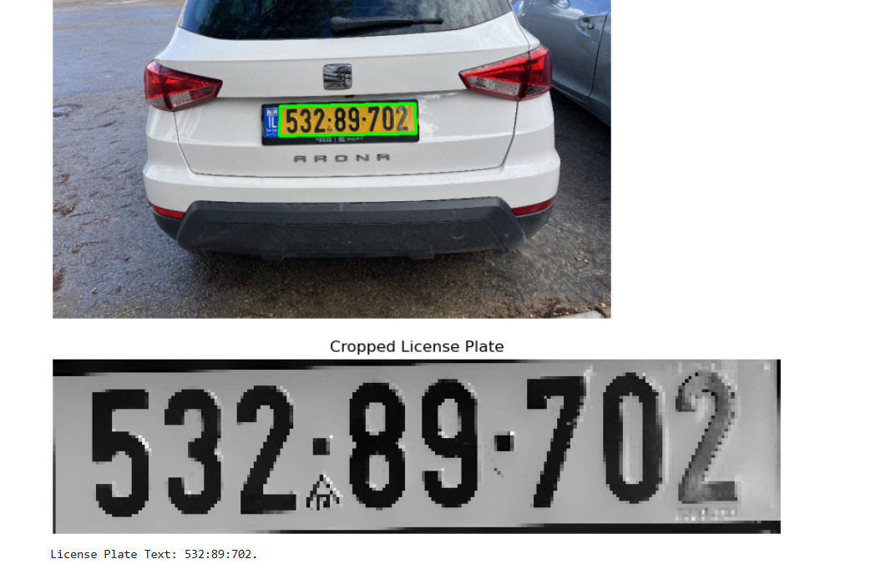
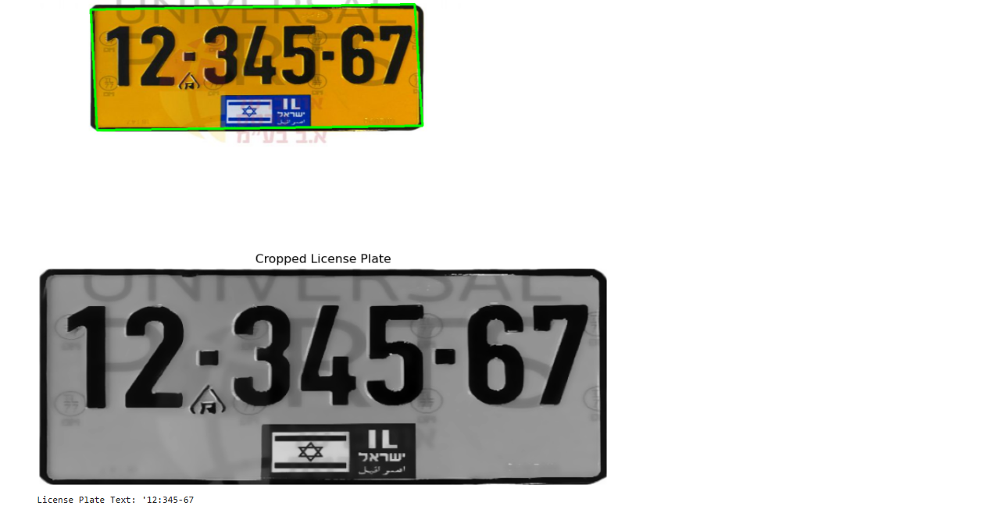

# License Plate Recognition

A simple computer vision project that detects and recognizes license plates **without any deep learning model**.  
It uses classic image processing techniques (thresholding, Canny edge detection, and contour approximation) combined with **Tesseract OCR** to read the license plate text.

## Features
- **No model training needed**: purely based on OpenCV and Tesseract OCR.
- **Edge detection and contour filtering** to locate the plate region.
- **OCR** to extract the license plate number.

  

